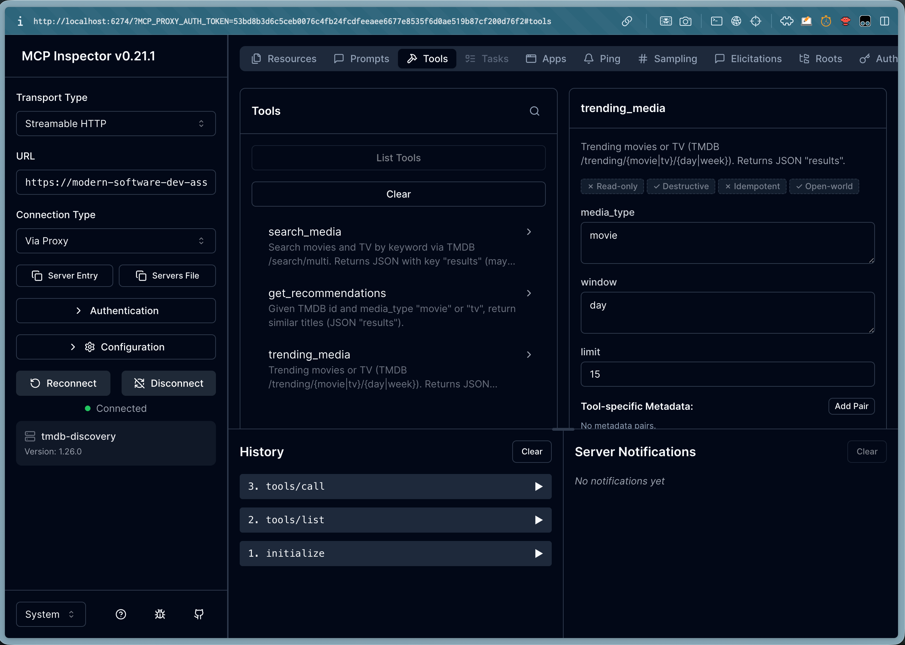
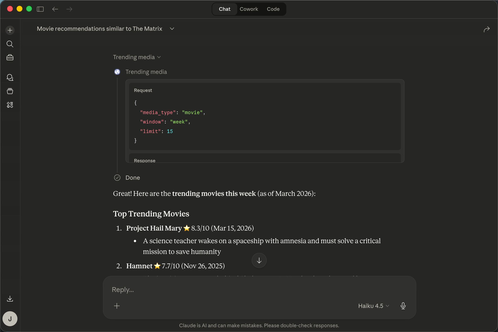

# Week 3: TMDB MCP Server
1. Deployed on Vercel: 


2. Called using Claude Desktop:



This project wraps the TMDB API as an MCP server.

It supports two deployment modes:

- local STDIO for Claude Desktop
- remote Streamable HTTP for cloud deployment on Vercel

## Tools

The server exposes three tools:

- `search_media`
- `get_recommendations`
- `trending_media`

## TMDB Endpoints Used

- `GET /search/multi`
- `GET /movie/{id}/recommendations`
- `GET /tv/{id}/recommendations`
- `GET /trending/{movie|tv}/{day|week}`

## Setup

From the repository root:

```bash
poetry lock
poetry install
```

Create `week3/.env` for local development:

```env
TMDB_API_KEY=your_tmdb_api_key_here
```

For cloud deployment, set `TMDB_API_KEY` as an environment variable in Vercel instead of relying on `.env`.

## Project Entry Points

- `week3.server.main`: local STDIO entrypoint
- `week3.server.http_main`: remote HTTP entrypoint
- `api/index.py`: Vercel ASGI entrypoint

## Local STDIO with Claude Desktop

Claude Desktop launches the local server with:

```bash
python -m week3.server.main
```

Example `claude_desktop_config.json` entry:

```json
{
  "mcpServers": {
    "tmdb-discovery": {
      "command": "/opt/anaconda3/envs/cs146s/bin/python",
      "args": ["-m", "week3.server.main"],
      "cwd": "/Users/jerryzeng/Documents/modern-software-dev-assignments",
      "env": {
        "PYTHONPATH": "/Users/jerryzeng/Documents/modern-software-dev-assignments"
      }
    }
  }
}
```

After saving the config, fully quit and reopen Claude Desktop.

Example prompts:

- `Please use tmdb-discovery to search for Inception.`
- `Use tmdb-discovery to find The Matrix and recommend similar movies.`
- `Use tmdb-discovery to list today's trending movies.`

## Local HTTP Testing

Before deploying, the remote version can be tested locally with:

```bash
uvicorn week3.server.http_main:app --host 0.0.0.0 --port 8000
```

Endpoints:

```text
http://127.0.0.1:8000/mcp
http://127.0.0.1:8000/health
```

I verified the remote HTTP version locally with MCP Inspector using Streamable HTTP.

## Vercel Deployment

This repository includes:

- `api/index.py` as the Vercel Python entrypoint
- `vercel.json` for routing
- a `pyproject.toml` configuration compatible with Vercel Python builds

To deploy:

1. Push the latest code to GitHub.
2. Import the repository into Vercel.
3. Use the repository root as the project root.
4. Set `TMDB_API_KEY` in Vercel Environment Variables.
5. Deploy.

After deployment, the MCP endpoint is:

```text
https://modern-software-dev-assignments-two.vercel.app/mcp
```

Health check:

```text
https://modern-software-dev-assignments-two.vercel.app/health
```

## Why the Remote Fix Was Needed

The remote deployment runs on Vercel Functions, which are effectively stateless.  
A stateful HTTP MCP session worked locally, but failed on Vercel with `Session not found` because requests could land on different instances.

The fix was to configure the server as stateless HTTP:

- `host="0.0